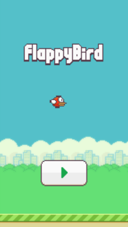
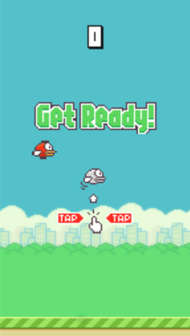
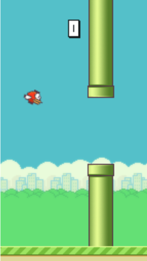
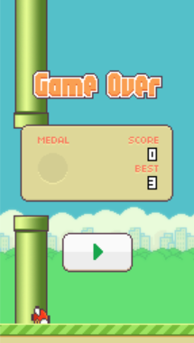

# phaser-flappy-bird 
yet another flappy bird clone built with phaser

## Intro

Clone the "flappy bird" game while playing around [phaser](https://phaser.io/). As this game is simple enough even for one person,  also it's good starting point to explore and get familiar with Phaser's core function and API. 

> The devil is in the detail

I Try to clone the full game and implement as much detail as I can. Including all the menu, text, animation, score dashboard, audio, etc. What's the fun if only  just make a rough demo ?

## Screenshot

  

  

## Demo

play it [here ](https://raychenfj.github.io/phaser-flappy-bird/).

## Install

Simply clone or download this repo, and like any other javascript project, run `npm install` and `npm start`.

Visit `http://192.168.1.2:9966/` to start the game.

## License

MIT